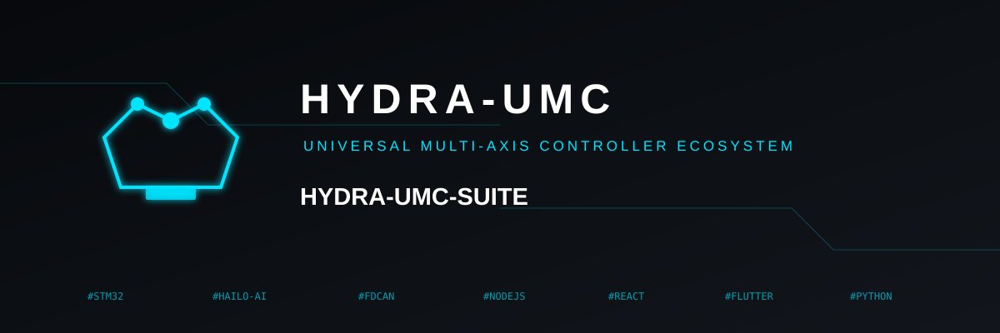

<p align="center">
  
</p>

# 🧰 HYDRA-UMC SUITE

<p align="center">
  <a href="README.md">🇺🇸 English</a> |
  <a href="README_spa.md">🇪🇸 Español</a> |
  <a href="README_fra.md">🇫🇷 Français</a> |
  <a href="README_ita.md">🇮🇹 Italiano</a> |
  <a href="README_deu.md">🇩🇪 Deutsch</a> |
  <a href="README_zho.md">🇨🇳 简体中文</a> |
  🇯🇵 <b>日本語</b>
</p>


### 🖥️ HYDRA-UMC プラットフォーム向けマルチコントローラー群制御コマンドセンター

<p align="left">
  
  
  
  
</p>


---

## 🎯 概要

**HYDRA-UMC SUITE** は、[HYDRA-UMC](https://github.com/JuanenRac/HYDRA-UMC) コントローラーの艦隊全体を一度にミッションコントロールするために構築された、ネイティブな Windows/Linux デスクトップアプリケーション（Python + PySide6/Qt6）です——ローカルネットワークをスキャンする（あるいは、異なる物理ネットワーク上の HYDRA-UMC への既存の VPN トンネル経由も含め、手動で 1 台を追加する）、見つかったすべてに接続する、そしてそれらのいずれかを、1 つのフルスクリーン産業用ダッシュボードから並べてリアルタイムにジョグ／監視／再設定します。

これは、[HYDRA-UMC SERVER](https://github.com/JuanenRac/HYDRA-UMC-SERVER) が公開しているのとまったく同じワイヤープロトコルを話します——[HYDRA-UMC STUDIO](https://github.com/JuanenRac/HYDRA-UMC-STUDIO) 自身のブラウザ UI もそのただ 1 つのクライアントとして同じヘッドレスバックエンドと通信しています——完全な契約は [`HYDRA-UMC-SERVER/docs/REMOTE_API.md`](https://github.com/JuanenRac/HYDRA-UMC-SERVER/blob/main/docs/REMOTE_API.md) を参照してください。これは本プロジェクトをサポートするために特別に追加されたものです。SUITE から行われた変更は、開いているブラウザタブにリアルタイムで反映され、その逆も同様です——一方向的なインポート/エクスポートではなく、WebSocket 経由の真の双方向リアルタイム同期です。

**本エコシステムの他のドキュメントと同じ慣例に従った正直な注記：** これは最初の実際に動作するバージョンであり、完成品ではありません。今日実際に実装され、エンドツーエンドで検証されているものと、意図的に後回しにされているものの正確な内容は、[`docs/ROADMAP.md`](docs/ROADMAP.md) を参照してください。このバージョンの時点で、本エコシステムがサポートするすべての実在するロボットモデルには、3D ビューポートに実際の STL ジオメトリと数値検証済みの正運動学が接続されています（Parol6、Faze4、AR3、AR4、UR3e/5e/10e/16e/20、xArm6、Lite 6、e.DO）。加えて、専用のメッシュセットを持たないあらゆるモデル向けに、プリミティブで構築された「汎用」フォールバックも用意されています。

---

## ✨ ビジュアル・コマンドデッキ

デスクトップには、公式 HYDRA-UMC アイコンと HYDRA-UMC-UPDATER と同じ濃紺/シアンの視覚言語を使用した、ゲームメニュー風の常設コマンドデッキが加わりました。ダッシュボード、ロボット操作、カメラ、軌道、ログの操作は対応する実際のドッキングパネルを開き、右側には接続状態、アクティブサーバーターゲット、UTC 時計を表示します。これは Suite の実機能上の視覚レイヤーであり、模擬ダッシュボードではありません。

## 🏭 機能

- **🔍 ネットワークディスカバリー** —— 実際の HYDRA-UMC STUDIO サーバーに対する並行サブネットスキャン（`GET /api/hydra-info`）、加えてスキャンが到達できないもの（異なるサブネット、VPN トンネル）向けの手動アドレス追加。
- **🐝 群接続** —— 好きなだけ多くの HYDRA-UMC サーバーへ同時に接続でき、それぞれが自身のリアルタイム WebSocket 同期を持ちます。他のパネルにとってどれを「アクティブ」にするか選択できます。
- **📊 概要** —— コントローラーごとのロボット一覧：型式、役割、オンライン状態、速度/加速度を一目で確認できます。
- **🦾 ロボット制御** —— 各関節ごとのロータリーノブ＋スライダー（HYDRA-UMC STUDIO 自身の `RotaryKnob`+`FuturisticSlider` ジョグペアのデスクトップ版対応物）、速度/加速度スライダー、すべてリアルタイムで書き戻されます。
- **🧊 実際の 3D ビューポート** —— OpenGL 3.3、実際の STL メッシュ、24 個の実在するロボットモデルすべてに対する実際の正運動学（HYDRA-UMC STUDIO 自身の TypeScript 実装に対して数値検証済みで、結果はビット単位で同一）に加え、プリミティブで構築された「汎用」フォールバック——いずれも様式化されたプレースホルダーではありません。
- **📍 軌道ポイント** —— 選択したロボットの実時間の姿勢を記録し、必要に応じて記録済みのポイントへジョグして戻ります。
- **🪟 Photoshop 風のドッキング可能なワークスペース** —— すべてのパネルは本物の `QDockWidget` です：ドラッグして自由に浮遊させる、ドラッグして戻してドッキングまたはタブグループへ統合する、ワークスペースを分割する、閉じる、そして View メニューから再表示する、といった操作が可能です。パネルをフローティング化すると、それは真に独立したトップレベルウィンドウになるため、2 台目（あるいは 3 台目）の物理モニターへドラッグしてそこに置いておくことがそのまま機能します——Qt/OS のウィンドウマネージャーが他のウィンドウと同様にそれを配置するため、追加の「マルチモニターモード」は不要です。
- **🌐 7 言語** —— 英語、スペイン語、イタリア語、フランス語、ドイツ語、簡体中国語、日本語（URTC-FLASHER/URTC-TESTER と同じ `language/*.lng` 方式）、Language メニューから切り替え（再起動後に反映）。
- **📷 カメラ** —— コントローラーごとの実際のカメラ一覧（存在するカメラ、その種類、接続状態）を、ここにある他のすべてのパネルと同じ方式で実際のサーバーと同期します——映像フィード自体は明確にラベル付けされたプレースホルダーで、HYDRA-UMC-STUDIO 自身の CamerasView.tsx の正直さの境界に一致しています（本エコシステムには、まだどこにも実際のカメラハードウェア/ストリームは存在しません）。

---

## 📸 スクリーンショット

まだありません——ドキュメント用にはまだ撮影されていません。実際の姿を見るには、後で古びた画像を信頼するのではなく、（下記の手順で）実際に起動してみてください。

---

## 📂 リポジトリ構成

```text
HYDRA-UMC-SUITE/
├── main.py                        # エントリポイント——フルスクリーン、最小 1920x1080、F11 でフルスクリーン/ウィンドウ表示を切替
├── requirements.txt
├── HYDRA-UMC_SUITE.spec           # PyInstaller の spec ファイル（下記 build_exe.bat/.sh 参照）
├── build_exe.bat                  # ワンショット Windows ビルド -> dist/HYDRA-UMC_SUITE.exe
├── build_exe.sh                   # ワンショット Linux ビルド -> dist/HYDRA-UMC_SUITE
├── README.md                      # 本ファイル
├── README_spa.md / README_ita.md / README_fra.md / README_deu.md / README_zho.md / README_jpn.md  <- 翻訳
├── hydra_suite/
│   ├── models.py                   # HydraState/ControllerView/RobotView —— 実際の settings.json の形状に対する
│   │                                 薄く、変更しやすいビュー
│   ├── app.py                      # SuiteController —— 接続の群れ、「アクティブ」選択を保持、すべてのパネルがこれと通信
│   ├── i18n.py                     # 7 言語 KEY=Value ローダー（language/*.lng）
│   ├── net/
│   │   ├── discovery.py             # GET /api/hydra-info に対する並行サブネットスキャン
│   │   └── client.py                # サーバーごとの REST + WebSocket 接続、リアルタイム双方向同期、ログイン
│   ├── render/
│   │   ├── kinematics.py            # 正運動学（HYDRA-UMC-STUDIO 自身の urKinematicsShared.ts から移植）
│   │   ├── generic_rig.py           # 専用メッシュセットを持たないあらゆるモデル向けのプリミティブ構築フォールバックリグ
│   │   ├── mesh.py                  # STL 読み込み（numpy-stl）
│   │   └── viewport.py              # QOpenGLWidget —— 実際の GLSL シェーダーパイプライン、オービットカメラ
│   └── ui/
│       ├── main_window.py           # QMainWindow + QDockWidget ワークスペース
│       ├── theme.py                  # assets/qss/industrial_dark.qss を読み込み
│       ├── widgets/rotary_knob.py    # カスタム描画のロータリーノブ（RotaryKnob.tsx のデスクトップ版対応物）
│       └── panels/                   # server_browser.py, overview.py, robot_control.py, viewport_panel.py, trajectory_panel.py, cameras_panel.py, logs_panel.py
├── assets/
│   ├── qss/industrial_dark.qss     # 未来的な産業用 Qt スタイルシート
│   └── meshes/                      # 実際の STL メッシュ、ロボットごとに 1 フォルダ（24 モデル）、
│                                       HYDRA-UMC-STUDIO 自身の public/models/<robot>/ からコピー（それぞれ自身の ATTRIBUTION.txt 付き）
├── language/                        # english/spanish/italian/french/german/chinese/japanese の .lng ファイル
├── docs/
│   └── ROADMAP.md                   # 実際に実装済みか否かを正直に述べたスコープ文書
├── tests/                           # 手動の統合スモークテスト（実際に稼働中の HYDRA-UMC STUDIO サーバーが必要——
│                                       モック化された単体テストスイートではない）+ 運動学検証スクリプト
└── .vscode/                         # Python インタープリターのパス、起動設定、推奨拡張機能
```

---

## 🚀 はじめに

### 必要環境
- Python 3.12 以上（3.14 で開発/テスト済み）
- 接続先となる、稼働中の [HYDRA-UMC STUDIO](https://github.com/JuanenRac/HYDRA-UMC-STUDIO) サーバー

### インストール

```bash
python -m venv .venv
.venv\Scripts\activate      # Windows
# source .venv/bin/activate   # Linux

pip install -r requirements.txt
```

### 実行

```bash
python main.py
```

最小 1920x1080 のフルスクリーンで起動します（本アプリ自身の設計仕様に基づく）——いつでも **F11** を押すことでフルスクリーンと通常の最大化ウィンドウを切り替えられるため、逃げ道なくトラップされることは決してありません。**Servers** パネルを使ってネットワークをスキャンするか、アドレスを指定して HYDRA-UMC STUDIO サーバーを追加してください。

---

## 🛠️ 技術スタック

- **UI フレームワーク：** PySide6（Qt6）——ネイティブなドッキング可能パネル、カスタムドッキングフレームワークの再発明はなし
- **3D レンダリング：** PyOpenGL（コアプロファイル GLSL シェーダー）+ numpy-stl
- **ネットワーキング：** `httpx`（REST）+ `websockets`（リアルタイム同期）、`qasync` を介して Qt 自身のイベントループに統合——別個のワーカースレッドなし
- **数学：** NumPy（正運動学のための 4x4 同次変換）

---

## 📦 スタンドアロン実行ファイルのビルド

2 通りの方法、結果は同じです（Windows では `dist/HYDRA-UMC_SUITE.exe`、Linux では `dist/HYDRA-UMC_SUITE`）——どちらの方法でも、出力を実行するのに Python のインストールは不要です。

**自動化（推奨）：**

```bash
build_exe.bat    # Windows
./build_exe.sh   # Linux
```

各スクリプトは `.venv` を作成/再利用し、そこに `requirements.txt` + PyInstaller をインストールし、以前の `build/`/`dist/` があれば削除し、PyInstaller でコンパイルし（`assets/` と、本アプリが実際に使用する 4 つの Qt プラグインサブフォルダのみ——`platforms`/`styles`/`imageformats`/`iconengines`——をバンドルし、PySide6 パッケージ全体ではないため、結果が数百 MB ではなく数十 MB に収まります）、`README.md`/`LICENSE`/`docs/` および編集可能な `language/*.lng` ファイルを、実行ファイル内に凍結するのではなく、その隣にコピーします。

**手動での同等の手順**（すべてのステップを自分自身で確認/制御したい場合。上記スクリプトが実行するのと同じコマンド）：

```bash
python -m venv .venv
.venv\Scripts\activate          # Windows
# source .venv/bin/activate      # Linux

pip install -r requirements.txt
pip install pyinstaller

python -m PyInstaller --onefile --windowed --noconfirm --name "HYDRA-UMC_SUITE" ^
    --add-data "assets;assets" ^
    --add-data "<PySide6 install dir>\plugins\platforms;PySide6\plugins\platforms" ^
    --add-data "<PySide6 install dir>\plugins\styles;PySide6\plugins\styles" ^
    --add-data "<PySide6 install dir>\plugins\imageformats;PySide6\plugins\imageformats" ^
    --add-data "<PySide6 install dir>\plugins\iconengines;PySide6\plugins\iconengines" ^
    --hidden-import qasync --hidden-import websockets ^
    --hidden-import PySide6.QtOpenGL --hidden-import PySide6.QtOpenGLWidgets ^
    --hidden-import OpenGL.platform.win32 ^
    main.py

# その後、README.md、LICENSE、docs/、language/ を dist/HYDRA-UMC_SUITE.exe の隣にコピー
```

Linux では（正確な、テスト済みのコマンドは `build_exe.sh` を参照）、`--add-data` の区切り文字として `;` の代わりに `:` を使用し、`OpenGL.platform.win32` の隠れたインポート（Windows 専用）を削除し、`--windowed` を削除し、そちらではプラグインパスが 1 階層深くネストされている点に注意してください（Windows のフラットな `<PySide6 ディレクトリ>\plugins\platforms` に対し、`<PySide6 ディレクトリ>/Qt/plugins/platforms`）——これはその wheel パッケージ自体のパッケージング上の詳細であり、どちらのスクリプトが選んだものでもありません。リポジトリルートの `HYDRA-UMC_SUITE.spec` は、前回のビルドから PyInstaller 自身が生成した spec ファイルです——安全に削除して再生成できるもので、手作業で保守されているものではありません。

---

## 🔢 バージョン管理

`hydra_suite/__version__`（**Help > About** に表示）は、10 進法の繰り上げルールを持つ、オドメーター方式の `MAJOR.MINOR.PATCH` スキームに従います：実際のビルドのたびに patch が 1 増加し、9 を超えると 0 にリセットされて代わりに minor が 1 増加します（例：`0.1.9` -> `0.2.0`）。「実際のビルド」とは `build_exe.bat`/`build_exe.sh` の実行を意味し、単なる `python main.py` の実行の**たびではありません**。この加算自体は `bump_version.py` によって自動的に処理されます（PyInstaller が実行される前に、両方のビルドスクリプトから呼び出されます）。そのため、パッケージ化された `.exe`/バイナリは、常に実際に最後に出荷されたバージョンよりも厳密に新しいバージョン番号を持ちます。各時点での変更内容は [`CHANGELOG.md`](CHANGELOG.md) を参照してください。

---

## 🔗 関連プロジェクト

本プロジェクトは、同一著者（JuanenRac／Electro Hobby 3D）による、より大きなロボティクスエコシステムの一部です。ご要望が実際にはこれらのプロジェクトのいずれかに関するものであり、本リポジトリのものではない可能性もあるため、知っておく価値があります：

**HYDRA-UMC プラットフォーム** —— マルチロボット・マイクロファクトリーセル
- **[HYDRA-UMC](https://github.com/JuanenRac/HYDRA-UMC)** —— マザーボード本体：Raspberry Pi CM5 ホスト + デュアルコア STM32H745 リアルタイムコプロセッサ、CAN-OTA/SPI-OTA 経由で最大 8 台の分散ロボットアームを統括します。自社ハードウェア + ファームウェア、GPL-3.0/CERN-OHL-S v2/CC BY-SA 4.0。
- **[HYDRA-UMC STUDIO](https://github.com/JuanenRac/HYDRA-UMC-STUDIO)** —— HYDRA-UMC 向けの Web ベース制御ダッシュボード：マルチロボット 3D 可視化、運動学／軌道記録、プラットフォーム全体の CAN-OTA 書き込みとテスト。React + Vite + Three.js。
- **[HYDRA-UMC-SERVER](https://github.com/JuanenRac/HYDRA-UMC-SERVER)** —— かつて HYDRA-UMC-STUDIO 自身のプロセス内にバンドルされていたヘッドレスバックエンド（Node/Express/WebSocket）。ロボット制御 REST/WS API、settings.json の永続化、JWT 認証、mDNS ディスカバリーを保持します。HYDRA-UMC-STUDIO は現在、ネットワーク越しにこれと通信する純粋な静的フロントエンドクライアントです。
- **[HYDRA-UMC-ANDROID-CONTROL](https://github.com/JuanenRac/HYDRA-UMC-ANDROID-CONTROL)** —— Wi-Fi／Bluetooth 経由で HYDRA-UMC を制御する Android アプリ。実際に動作するアプリです——完全なリモート制御機能セット、JWT 認証、暗号化された資格情報の保存。
- **[HYDRA-UMC-IOS-CONTROL](https://github.com/JuanenRac/HYDRA-UMC-IOS-CONTROL)** —— Wi-Fi 経由で HYDRA-UMC を制御する iOS/iPadOS アプリ、Flutter 製（クロスプラットフォーム、Mac なしで Windows 上でも検証可能。最終的な `.ipa` パッケージングには Xcode が必要）。実際に動作するアプリです——Android アプリと同じ機能セット。
- **HYDRA-UMC-SUITE**（本リポジトリ）—— デスクトップ（Python/PySide6）製の群制御コマンドセンター：マルチコントローラーのネットワークディスカバリー、リアルタイムの双方向同期、実際の 3D ロボットビューポート、Photoshop 風のドッキング可能なワークスペース。実際に動作します、プレースホルダーではありません。
- **[HYDRA-UMC-EDITOR-URDF](https://github.com/JuanenRac/HYDRA-UMC-EDITOR-URDF)** —— デスクトップ（Python/PySide6）製のグラフィカル URDF 作成／編集ツール。本プロジェクト自身のモデルカタログ向け：GitHub またはローカルフォルダからソースファイルを取得し、自由度の実現可能性を検証し、リアルタイム 3D プレビューで色／スケール／運動学を編集し、完成した結果を稼働中の STUDIO サーバーへプッシュします。実際に動作します、プレースホルダーではありません。
- **[HYDRA-UMC-DSI](https://github.com/JuanenRac/HYDRA-UMC-DSI)** —— HYDRA-UMC 自身の 5"/7" DSI タッチスクリーン（両サイズとも解像度は 1280×720）向けのネイティブ Flutter タッチ UI。Compute Module 5 上で動作し、ボードから直接この同じサーバーを制御します。実際に動作する雛形で、全 6 のカタログ画面（ダッシュボード、手動制御、カメラ、簡易 3D ビュー、システム指標、ログイン）がすべて実際のサーバーに接続済みです。実際の Linux ターゲットビルドはまだ実機で実行されていません（今のところ Windows 専用の動作環境——同プロジェクト自身の README を参照）。

**URTC プラットフォーム** —— HYDRA-UMC の各ロボットアームが搭載するツールヘッドコントローラー
- **[URTC](https://github.com/JuanenRac/URTC)** —— 汎用ロボットツールコントローラー：STM32F303 ベースの CAN バスツールヘッドコントローラー、25 種の完全実装済みツールプロファイル、CAN-OTA ファームウェア更新に対応。
- **[URTC Flasher](https://github.com/JuanenRac/URTC-FLASHER)** —— URTC ボード向けのデスクトップ製 CAN-OTA + フルチップ SWD/JTAG 書き込みツール（Windows/Linux）。
- **[URTC Tester](https://github.com/JuanenRac/URTC-TESTER)** —— URTC ボード向けのデスクトップ製リアルタイム CAN バス診断ツール、ツールプロファイルごとに 1 つのパネル（Windows/Linux）。
- **[URTC Web Studio](https://github.com/JuanenRac/URTC-WEB-STUDIO)** —— 上記 2 つのデスクトップツールに代わるブラウザベースの選択肢（Web Serial API + SLCAN）、ローカルインストール不要。

**直接関連するツール**
- **[HYDRA-UMC-HIL-BRIDGE](https://github.com/JuanenRac/HYDRA-UMC-HIL-BRIDGE)** —— 本スイートが、まるで実際のハードウェアであるかのようにデジタルツインを駆動できるようにします。稼働中の HYDRA-UMC コントローラーを、ワークフロー内の他の何も変更することなく、ハードウェアインザループブリッジに置き換えます。
- **[HYDRA-UMC-ORCHESTRATOR](https://github.com/JuanenRac/HYDRA-UMC-ORCHESTRATOR)** —— 本スイートが最終的に従う群制御コマンドセンターで、単一のデスクトップセッションが到達できるレベルを超えて、HYDRA-UMC コントローラー艦隊を協調させます。
- **[HYDRA-UMC-TOOL-CLI](https://github.com/JuanenRac/HYDRA-UMC-TOOL-CLI)** —— このデスクトップスイートと同じ DevOps 機能セットをコマンドラインから提供し、スクリプティングやヘッドレス環境向けです。

**エコシステムのその他のプロジェクト**

上記の HYDRA-UMC および URTC プラットフォームを超えて、同じ著者は以下の分野にわたる多くの他のプロジェクトを維持しています：

- 👁️ **Vision AI Node (Hailo-8)：** [HYDRA-UMC-VISION-NODE](https://github.com/JuanenRac/HYDRA-UMC-VISION-NODE) · [HYDRA-UMC-VISION-STREAMER](https://github.com/JuanenRac/HYDRA-UMC-VISION-STREAMER) · [HYDRA-UMC-DETECTION-HEF](https://github.com/JuanenRac/HYDRA-UMC-DETECTION-HEF) · [HYDRA-UMC-SAFETY-ZONES](https://github.com/JuanenRac/HYDRA-UMC-SAFETY-ZONES) · [HYDRA-UMC-VISUAL-SERVOING-API](https://github.com/JuanenRac/HYDRA-UMC-VISUAL-SERVOING-API)
- 🧠 **Cognitive AI Node (Hailo-10)：** [HYDRA-UMC-COGNITIVE-NODE](https://github.com/JuanenRac/HYDRA-UMC-COGNITIVE-NODE) · [HYDRA-UMC-VLA-ENGINE](https://github.com/JuanenRac/HYDRA-UMC-VLA-ENGINE) · [HYDRA-UMC-VOICE-UI](https://github.com/JuanenRac/HYDRA-UMC-VOICE-UI) · [HYDRA-UMC-SEMANTIC-PLANNER](https://github.com/JuanenRac/HYDRA-UMC-SEMANTIC-PLANNER) · [HYDRA-UMC-DOCS-QA](https://github.com/JuanenRac/HYDRA-UMC-DOCS-QA)
- 🐝 **Orchestration & Swarm：** [HYDRA-UMC-SWARM-SYNC](https://github.com/JuanenRac/HYDRA-UMC-SWARM-SYNC) · [HYDRA-UMC-PATH-PLANNER-3D](https://github.com/JuanenRac/HYDRA-UMC-PATH-PLANNER-3D) · [HYDRA-UMC-JOB-DISPATCHER](https://github.com/JuanenRac/HYDRA-UMC-JOB-DISPATCHER) · [HYDRA-UMC-NODE-HEALING](https://github.com/JuanenRac/HYDRA-UMC-NODE-HEALING)
- 🎮 **Digital Twin & Simulation：** [HYDRA-UMC-TWIN](https://github.com/JuanenRac/HYDRA-UMC-TWIN) · [HYDRA-UMC-PHYSICS-REPLICA](https://github.com/JuanenRac/HYDRA-UMC-PHYSICS-REPLICA) · [HYDRA-UMC-SYNTHETIC-DATA-GEN](https://github.com/JuanenRac/HYDRA-UMC-SYNTHETIC-DATA-GEN)
- 📊 **Data & Analytics：** [HYDRA-UMC-DATALAKE](https://github.com/JuanenRac/HYDRA-UMC-DATALAKE) · [HYDRA-UMC-TELEMETRY-COLLECTOR](https://github.com/JuanenRac/HYDRA-UMC-TELEMETRY-COLLECTOR) · [HYDRA-UMC-ANOMALY-DETECTOR](https://github.com/JuanenRac/HYDRA-UMC-ANOMALY-DETECTOR) · [HYDRA-UMC-PRODUCTION-REPORTS](https://github.com/JuanenRac/HYDRA-UMC-PRODUCTION-REPORTS)
- 🏭 **Industrial Gateway：** [HYDRA-UMC-GATEWAY-INDUSTRIAL](https://github.com/JuanenRac/HYDRA-UMC-GATEWAY-INDUSTRIAL) · [HYDRA-UMC-OPCUA-SERVER](https://github.com/JuanenRac/HYDRA-UMC-OPCUA-SERVER) · [HYDRA-UMC-MQTT-BROKER](https://github.com/JuanenRac/HYDRA-UMC-MQTT-BROKER) · [HYDRA-UMC-MTCONNECT-ADAPTER](https://github.com/JuanenRac/HYDRA-UMC-MTCONNECT-ADAPTER)
- 🛠️ **Complementary Tools：** [URTC-SMART-RACK](https://github.com/JuanenRac/URTC-SMART-RACK) · [URTC-VISION-TOOL](https://github.com/JuanenRac/URTC-VISION-TOOL) · [HYDRA-UMC-WATCH](https://github.com/JuanenRac/HYDRA-UMC-WATCH) · [HYDRA-UMC-DASHBOARD-AI](https://github.com/JuanenRac/HYDRA-UMC-DASHBOARD-AI)

---

## 👤 作者

**JuanenRac**（Electro Hobby 3D）
📧 electrohobby3d@gmail.com
📺 youtube.com/@electrohobby3d

---

## 📜 ライセンスと著作権表示

HYDRA-UMC SUITE の著作権は (c) 2026 JuanenRac（Electro Hobby 3D）に帰属します。本プロジェクトまたはその派生物を配布する際は、この表示を必ず含めてください。

本アプリケーションのソースコードは、**GNU General Public License v3.0（GPL-3.0）** の下で提供されます。全文は https://www.gnu.org/licenses/gpl-3.0.html を参照してください。

**本ドキュメント**（本 README およびその自身の翻訳版——`README_spa.md`、`README_ita.md`、`README_fra.md`、`README_deu.md`、`README_zho.md`、`README_jpn.md`）は、**クリエイティブ・コモンズ 表示-継承 4.0 国際（CC BY-SA 4.0）** の下で提供されます。全文は https://creativecommons.org/licenses/by-sa/4.0/ を参照してください。

**サードパーティのメッシュアセット：** `assets/meshes/` 下のすべてのフォルダは、そのロボット自身の公式メーカーリポジトリからそのままコピーされたものです——上記の GPL-3.0 の対象では **ありません**。それぞれが、正確な出典/ライセンス参照を記した自身の `ATTRIBUTION.txt` を持ちます。下表はそれらをまとめたものです。

| メーカー | モデル | ライセンス |
|---|---|---|
| Source Robotics | Parol6 | GPL-3.0 |
| Source Robotics | Faze4 | MIT |
| Annin Robotics | AR3, AR4 | MIT |
| Universal Robots | UR3e, UR5e, UR10e, UR16e, UR20 | BSD-3-Clause |
| UFACTORY | xArm6, Lite 6 | BSD-3-Clause |
| Comau | e.DO | BSD-3-Clause |
| Kinova | Gen3 Lite | BSD-3-Clause |
| FANUC | M-710iC | BSD-3-Clause |
| The Robot Studio | SO-ARM100 | Apache-2.0 |
| Kinova | Gen2 (j2s6s200) | BSD-3-Clause |
| AgileX | PiPER | Apache-2.0 |
| Unitree | Z1 | BSD-3-Clause |
| Trossen Robotics | ViperX 300, WidowX 250 | BSD-3-Clause |
| Koch / Low-Cost Robot Arm | Koch v1.1 | Apache-2.0 |
| Universal Robots (classic) | UR3, UR5, UR10 | BSD-3-Clause |

本プロジェクトは [HYDRA-UMC STUDIO](https://github.com/JuanenRac/HYDRA-UMC-STUDIO) のデスクトップ版群制御対応物です——その自身の独立したライセンスは同プロジェクト自身のリポジトリを参照してください。本リポジトリ自身のライセンスはそちらには及ばず、その逆も同様です。また、最終的には [HYDRA-UMC](https://github.com/JuanenRac/HYDRA-UMC) のハードウェア/ファームウェア、および（[それを経由して中継される](https://github.com/JuanenRac/HYDRA-UMC/blob/main/docs/architecture.md)）[URTC](https://github.com/JuanenRac/URTC) ツールヘッドを制御します——いずれもそれぞれ独立したライセンスを持つ独立したプロジェクトです。

本プロジェクトを基に開発を行う際は、このライセンス区分を念頭に置いてください：コードの変更は GPL-3.0 を維持し、各ロボット自身のメッシュアセットはそれぞれの原本ライセンス条件のもとに維持してください（上表参照）——いずれも本プロジェクトおよびその作者への帰属表示を伴う必要があります。
