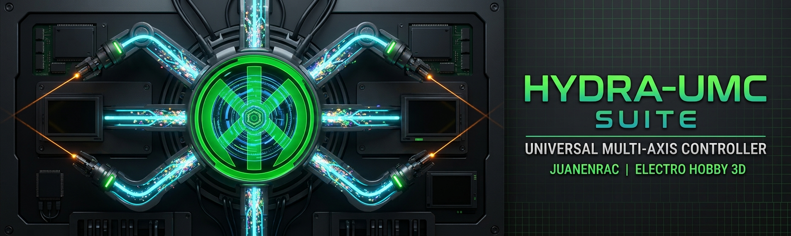

<p align="center">
  
</p>

# 🧰 HYDRA-UMC SUITE

### 🖥️ Centro de Mando de Enjambre Multi-Controladora para la Plataforma HYDRA-UMC

---

## 🎯 Resumen

**HYDRA-UMC SUITE** es una aplicación de escritorio nativa Windows/Linux (Python
+ PySide6/Qt6) construida como un centro de control de misión para toda una
flota de controladoras [HYDRA-UMC](https://github.com/JuanenRac/HYDRA-UMC) a
la vez - escanea la red local (o añade una manualmente, incluso a través de
un túnel VPN ya conectado hacia una HYDRA-UMC en una red física distinta),
conecta con tantas como se encuentren, y controla/monitoriza/reconfigura
cualquiera de ellas en vivo, una junto a otra, desde un único panel
industrial a pantalla completa.

Habla exactamente el mismo protocolo de cable que usa la propia interfaz
web de [HYDRA-UMC STUDIO](https://github.com/JuanenRac/HYDRA-UMC-STUDIO) -
ver
[`HYDRA-UMC-STUDIO/docs/REMOTE_API.md`](https://github.com/JuanenRac/HYDRA-UMC-STUDIO/blob/main/docs/REMOTE_API.md)
para el contrato completo, añadido específicamente para dar soporte a este
proyecto. Un cambio hecho desde SUITE aparece en vivo en una pestaña de
navegador abierta, y viceversa - sincronización bidireccional real por
WebSocket, no una importación/exportación de una sola vez.

**Nota de honestidad, siguiendo la misma convención de documentación que el
resto de este ecosistema:** esta es una primera pasada real y funcional, no
un producto terminado. Ver [`docs/ROADMAP.md`](docs/ROADMAP.md) para saber
exactamente qué está genuinamente implementado y verificado de extremo a
extremo hoy frente a lo que se ha dejado deliberadamente fuera de alcance
para más adelante. A fecha de esta pasada, cada modelo de robot real que
soporta este ecosistema tiene geometría STL real y cinemática directa
verificada numéricamente cableada en el viewport 3D (Parol6, Faze4, AR3, AR4,
UR3e/5e/10e/16e/20, xArm6, Lite 6, e.DO), más un modo "Genérico" construido
con primitivas como respaldo para cualquier modelo sin un conjunto de mallas
propio.

---

## 🏭 Funcionalidades

- **🔍 Descubrimiento de red** - escaneo concurrente de subred en busca de
  servidores HYDRA-UMC STUDIO reales (`GET /api/hydra-info`), más
  añadido manual por dirección para cualquier cosa que un escaneo no pueda
  alcanzar (una subred distinta, un túnel VPN).
- **🐝 Conexiones de enjambre** - conecta con tantos servidores HYDRA-UMC
  simultáneamente como quieras, cada uno con su propia sincronización
  WebSocket en vivo; elige cuál está "activo" para el resto de paneles.
- **📊 Resumen general** - listado de robots por controladora: modelo, rol,
  estado en línea, velocidad/aceleración, de un vistazo.
- **🦾 Control de robot** - rotario + slider por cada joint (el equivalente
  de escritorio del propio par de control `RotaryKnob`+`FuturisticSlider` de
  HYDRA-UMC STUDIO), sliders de velocidad/aceleración, todo escribiendo de
  vuelta en vivo.
- **🧊 Viewport 3D real** - OpenGL 3.3, mallas STL reales, cinemática
  directa real para los 24 modelos de robot reales (verificada
  numéricamente contra la propia implementación TypeScript de HYDRA-UMC
  STUDIO, resultados idénticos bit a bit) más un modo "Genérico" construido
  con primitivas - no un marcador de posición estilizado para ninguno de
  ellos.
- **📍 Puntos de trayectoria** - graba la pose en vivo del robot
  seleccionado, vuelve a cualquier punto grabado bajo demanda.
- **🪟 Espacio de trabajo acoplable estilo Photoshop** - cada panel es un
  `QDockWidget` real: arrastra para flotar libremente, arrastra de vuelta
  para acoplar o fusionar en un grupo de pestañas, divide el espacio de
  trabajo, ciérralo y vuelve a mostrarlo desde el menú Ver.
- **🌐 5 idiomas** - English, Español, Italiano, Français, Deutsch (misma
  convención `language/*.lng` que URTC-FLASHER/URTC-TESTER), se cambia
  desde el menú Idioma (efectivo tras reiniciar).
- **📷 Cámaras** - listado real de cámaras por controladora (qué cámaras
  existen, su tipo, estado de conexión) sincronizado con el servidor real
  de la misma forma que cualquier otro panel de aquí - el propio feed de
  vídeo es un marcador de posición claramente etiquetado, siguiendo el
  mismo límite de honestidad que el propio CamerasView.tsx de
  HYDRA-UMC-STUDIO (todavía no existe hardware/stream de cámara real en
  ninguna parte de este ecosistema).

---

## 📸 Fotos

Todavía sin capturas - aún no capturadas para la documentación. Lánzalo (ver
abajo) para ver la cosa real en vez de confiar en una imagen desactualizada
aquí más adelante.

---

## 📂 Estructura del Repositorio

```text
HYDRA-UMC-SUITE/
├── main.py                        # Punto de entrada - pantalla completa 1920x1080 minimo, F11 alterna pantalla completa/ventana
├── requirements.txt
├── HYDRA-UMC_SUITE.spec           # Spec de PyInstaller (ver build_exe.bat/.sh mas abajo)
├── build_exe.bat                  # Compilacion Windows de un solo paso -> dist/HYDRA-UMC_SUITE.exe
├── build_exe.sh                   # Compilacion Linux de un solo paso -> dist/HYDRA-UMC_SUITE
├── README.md                      # este archivo
├── README_spa.md / README_ita.md / README_fra.md / README_deu.md  <- traducciones
├── hydra_suite/
│   ├── models.py                   # HydraState/ControllerView/RobotView - vistas finas, faciles de mutar sobre la forma real de settings.json
│   ├── app.py                      # SuiteController - posee el enjambre de conexiones, la seleccion "activa", cada panel habla con esto
│   ├── i18n.py                     # Cargador de 5 idiomas CLAVE=Valor (language/*.lng)
│   ├── net/
│   │   ├── discovery.py             # Escaneo concurrente de subred contra GET /api/hydra-info
│   │   └── client.py                # Conexion REST + WebSocket por servidor, sincronizacion bidireccional en vivo, login
│   ├── render/
│   │   ├── kinematics.py            # Cinematica directa (portada del propio urKinematicsShared.ts de HYDRA-UMC-STUDIO)
│   │   ├── generic_rig.py           # Rig de respaldo construido con primitivas para cualquier modelo sin conjunto de mallas propio
│   │   ├── mesh.py                  # Carga de STL (numpy-stl)
│   │   └── viewport.py              # QOpenGLWidget - pipeline de shaders GLSL real, camara orbital
│   └── ui/
│       ├── main_window.py           # QMainWindow + espacio de trabajo QDockWidget
│       ├── theme.py                  # Carga assets/qss/industrial_dark.qss
│       ├── widgets/rotary_knob.py    # Rotario pintado a medida (equivalente de escritorio de RotaryKnob.tsx)
│       └── panels/                   # server_browser.py, overview.py, robot_control.py, viewport_panel.py, trajectory_panel.py, cameras_panel.py
├── assets/
│   ├── qss/industrial_dark.qss     # La hoja de estilo Qt "futurista industrial"
│   └── meshes/                      # Mallas STL reales, una carpeta por robot (24 modelos), copiadas del propio public/models/<robot>/ de HYDRA-UMC-STUDIO (cada una con su propio ATTRIBUTION.txt)
├── language/                        # Archivos .lng en ingles/espanol/italiano/frances/aleman
├── docs/
│   └── ROADMAP.md                   # Declaracion honesta de alcance real-vs-todavia-no
├── tests/                           # Pruebas de humo de integracion manual (requieren un servidor HYDRA-UMC STUDIO real en marcha - no una suite unitaria simulada) + scripts de verificacion de cinematica
└── .vscode/                         # Ruta del interprete de Python, configuraciones de lanzamiento, extensiones recomendadas
```

---

## 🚀 Primeros Pasos

### Requisitos
- Python 3.12+ (desarrollado/probado contra 3.14)
- Un servidor [HYDRA-UMC STUDIO](https://github.com/JuanenRac/HYDRA-UMC-STUDIO) en marcha con el que conectar

### Instalación

```bash
python -m venv .venv
.venv\Scripts\activate      # Windows
# source .venv/bin/activate   # Linux

pip install -r requirements.txt
```

### Ejecución

```bash
python main.py
```

Arranca a pantalla completa con un mínimo de 1920x1080 (según la propia
especificación de diseño de esta app) - pulsa **F11** para alternar entre
pantalla completa y una ventana maximizada normal en cualquier momento, así
que nunca te deja realmente atrapado sin una vía de escape. Usa el panel
**Servers** para escanear tu red o añadir un servidor HYDRA-UMC STUDIO por
dirección.

---

## 🛠️ Pila Tecnológica

- **Framework de UI:** PySide6 (Qt6) - paneles acoplables nativos, sin un
  framework de acoplamiento propio reinventado
- **Renderizado 3D:** PyOpenGL (shaders GLSL de perfil core) + numpy-stl
- **Red:** `httpx` (REST) + `websockets` (sincronización en vivo),
  integrado con el propio bucle de eventos de Qt mediante `qasync` - sin
  hilo de trabajo separado
- **Matemáticas:** NumPy (transformaciones homogéneas 4x4 para la
  cinemática directa)

---

## 📦 Compilar un ejecutable independiente

Dos caminos, mismo resultado (`dist/HYDRA-UMC_SUITE.exe` en Windows,
`dist/HYDRA-UMC_SUITE` en Linux) - no se necesita instalación de Python
para ejecutar el resultado en ningún caso.

**Automatizado (recomendado):**

```bash
build_exe.bat    # Windows
./build_exe.sh   # Linux
```

Cada script crea/reutiliza `.venv`, instala `requirements.txt` +
PyInstaller en él, limpia cualquier `build/`/`dist/` previo, compila con
PyInstaller (empaquetando `assets/` y solo las 4 subcarpetas de plugins Qt
que esta app realmente usa - `platforms`/`styles`/`imageformats`/
`iconengines`, no el paquete PySide6 completo, que es lo que mantiene el
resultado en decenas de MB en vez de cientos), y copia
`README.md`/`LICENSE`/`docs/` y los archivos editables `language/*.lng`
junto al ejecutable en vez de congelarlos dentro de él.

**Equivalente manual**, si quieres ver/controlar cada paso tú mismo (los
mismos comandos que ejecutan los scripts de arriba):

```bash
python -m venv .venv
.venv\Scripts\activate          # Windows
# source .venv/bin/activate      # Linux

pip install -r requirements.txt
pip install pyinstaller

python -m PyInstaller --onefile --windowed --noconfirm --name "HYDRA-UMC_SUITE" ^
    --add-data "assets;assets" ^
    --add-data "<PySide6 install dir>\plugins\platforms;PySide6\plugins\platforms" ^
    --add-data "<PySide6 install dir>\plugins\styles;PySide6\plugins\styles" ^
    --add-data "<PySide6 install dir>\plugins\imageformats;PySide6\plugins\imageformats" ^
    --add-data "<PySide6 install dir>\plugins\iconengines;PySide6\plugins\iconengines" ^
    --hidden-import qasync --hidden-import websockets ^
    --hidden-import PySide6.QtOpenGL --hidden-import PySide6.QtOpenGLWidgets ^
    --hidden-import OpenGL.platform.win32 ^
    main.py

# luego copia README.md, LICENSE, docs/, y language/ junto a dist/HYDRA-UMC_SUITE.exe
```

En Linux (ver `build_exe.sh` para el comando exacto y probado), usa `:` en
vez de `;` como separador de `--add-data`, elimina el hidden-import
`OpenGL.platform.win32` (solo Windows), elimina `--windowed`, y ten en
cuenta que ahí la ruta de plugins anida un nivel más profundo
(`<PySide6 dir>/Qt/plugins/platforms` frente al `<PySide6 dir>\plugins\platforms`
plano de Windows) - un detalle de empaquetado del propio wheel, no algo
que haya elegido ninguno de los 2 scripts. `HYDRA-UMC_SUITE.spec` en la
raíz del repositorio es el propio archivo spec generado por PyInstaller de
la última compilación - seguro de borrar y regenerar, no mantenido a mano.

---

## 🔗 Proyectos Relacionados

Este proyecto forma parte de un ecosistema de robótica más amplio del mismo autor (JuanenRac / Electro Hobby 3D). Vale la pena conocerlos, ya que una petición podría en realidad ser sobre uno de estos en vez de sobre este repositorio:

**Plataforma HYDRA-UMC** — la célula de micro-fábrica multi-robot
- **[HYDRA-UMC](https://github.com/JuanenRac/HYDRA-UMC)** — la placa base en sí: host Raspberry Pi CM5 + coprocesador de tiempo real STM32H745 de doble núcleo, orquestando hasta 8 brazos de robot distribuidos por CAN-OTA/SPI-OTA. Hardware + firmware propios, GPL-3.0/CERN-OHL-S v2/CC BY-SA 4.0.
- **[HYDRA-UMC STUDIO](https://github.com/JuanenRac/HYDRA-UMC-STUDIO)** — panel de control basado en web para HYDRA-UMC: visualización 3D multi-robot, cinemática/grabación de trayectorias, flasheo y pruebas CAN-OTA para toda la plataforma. React + Vite + Three.js.
- **[HYDRA-UMC-ANDROID-CONTROL](https://github.com/JuanenRac/HYDRA-UMC-ANDROID-CONTROL)** — app de control Android para HYDRA-UMC por Wi-Fi/Bluetooth. App real y funcional - conjunto completo de funciones de control remoto, autenticación JWT, almacenamiento cifrado de credenciales.
- **[HYDRA-UMC-IOS-CONTROL](https://github.com/JuanenRac/HYDRA-UMC-IOS-CONTROL)** — app de control iOS/iPadOS para HYDRA-UMC por Wi-Fi, construida en Flutter (multiplataforma, verificable en Windows sin un Mac; el empaquetado final `.ipa` todavía necesita Xcode). App real y funcional - mismo conjunto de funciones que la app de Android.
- **HYDRA-UMC-SUITE** *(este repositorio)* — centro de mando de enjambre de escritorio (Python/PySide6): descubrimiento de red multi-controladora, sincronización bidireccional en vivo, viewport 3D de robot real, espacio de trabajo acoplable estilo Photoshop. Real y funcional, no un marcador de posición.
- **[HYDRA-UMC-EDITOR-URDF](https://github.com/JuanenRac/HYDRA-UMC-EDITOR-URDF)** — creador/editor gráfico de URDF de escritorio (Python/PySide6) para el propio catálogo de modelos de este proyecto: extrae archivos fuente desde GitHub o una carpeta local, valida la viabilidad de los grados de libertad, edita color/escala/cinemática con una vista previa 3D en vivo, y sube el resultado terminado a un servidor STUDIO en marcha. Real y funcional, no un marcador de posición.
- **[HYDRA-UMC-DSI](https://github.com/JuanenRac/HYDRA-UMC-DSI)** — UI táctil nativa en Flutter para la propia pantalla táctil DSI de 5"/7" de HYDRA-UMC (1280×720, misma resolución en ambos tamaños) en la Compute Module 5, controlando este mismo servidor directamente desde la placa. Scaffold real y funcional con las 6 pantallas del catálogo (dashboard, control manual, cámara, vista 3D simplificada, métricas de sistema, login) conectadas al servidor en vivo; el build real del target Linux aún no se ha ejecutado en hardware real (entorno de trabajo solo Windows hasta ahora - ver el README propio de ese proyecto).

**Plataforma URTC** — la controladora de cabezal de herramienta que lleva cada brazo de robot HYDRA-UMC
- **[URTC](https://github.com/JuanenRac/URTC)** — Universal Robot Tool Controller: controladora de cabezal de herramienta por bus CAN basada en STM32F303, 25 perfiles de herramienta completamente implementados, actualización de firmware CAN-OTA.
- **[URTC Flasher](https://github.com/JuanenRac/URTC-FLASHER)** — herramienta de escritorio de flasheo CAN-OTA + chip completo SWD/JTAG para placas URTC (Windows/Linux).
- **[URTC Tester](https://github.com/JuanenRac/URTC-TESTER)** — herramienta de escritorio de diagnóstico de bus CAN en vivo para placas URTC, un panel por perfil de herramienta (Windows/Linux).
- **[URTC Web Studio](https://github.com/JuanenRac/URTC-WEB-STUDIO)** — alternativa basada en navegador a las 2 herramientas de escritorio de arriba (Web Serial API + SLCAN), sin necesidad de instalación local.

---

## 👤 Autor

**JuanenRac** (Electro Hobby 3D)
📧 electrohobby3d@gmail.com
📺 youtube.com/@electrohobby3d

---

## 📜 Licencia y Avisos de Copyright

HYDRA-UMC SUITE es (c) 2026 JuanenRac (Electro Hobby 3D). Este aviso debe incluirse en cualquier distribución de este proyecto o trabajos derivados.

El código fuente de esta aplicación está disponible bajo la **GNU General Public License v3.0 (GPL-3.0)**. Texto completo en https://www.gnu.org/licenses/gpl-3.0.html.

**Esta documentación** (este README y sus propias traducciones - `README_spa.md`, `README_ita.md`, `README_fra.md`, `README_deu.md`) está disponible bajo **Creative Commons Attribution-ShareAlike 4.0 International (CC BY-SA 4.0)**. Texto completo en https://creativecommons.org/licenses/by-sa/4.0/.

**Recursos de malla de terceros:** cada carpeta bajo `assets/meshes/` se copia textualmente del propio repositorio oficial del fabricante de ese robot - NO cubierta por la GPL-3.0 de arriba. Cada una tiene su propio `ATTRIBUTION.txt` con la referencia exacta de fuente/licencia; la tabla de abajo las resume.

| Fabricante | Modelos | Licencia |
|---|---|---|
| Source Robotics | Parol6 | GPL-3.0 |
| Source Robotics | Faze4 | MIT |
| Annin Robotics | AR3, AR4 | MIT |
| Universal Robots | UR3e, UR5e, UR10e, UR16e, UR20 | BSD-3-Clause |
| UFACTORY | xArm6, Lite 6 | BSD-3-Clause |
| Comau | e.DO | BSD-3-Clause |
| Kinova | Gen3 Lite | BSD-3-Clause |
| FANUC | M-710iC | BSD-3-Clause |
| The Robot Studio | SO-ARM100 | Apache-2.0 |
| Kinova | Gen2 (j2s6s200) | BSD-3-Clause |
| AgileX | PiPER | Apache-2.0 |
| Unitree | Z1 | BSD-3-Clause |
| Trossen Robotics | ViperX 300, WidowX 250 | BSD-3-Clause |
| Koch / Low-Cost Robot Arm | Koch v1.1 | Apache-2.0 |
| Universal Robots (clásicos) | UR3, UR5, UR10 | BSD-3-Clause |

Este proyecto es la contraparte de control de enjambre de escritorio de [HYDRA-UMC STUDIO](https://github.com/JuanenRac/HYDRA-UMC-STUDIO) - ver el propio repositorio de ese proyecto para su propia licencia separada, a la que la propia licencia de este repositorio no se extiende, y viceversa. También controla en última instancia el hardware/firmware de [HYDRA-UMC](https://github.com/JuanenRac/HYDRA-UMC) y ([relevados a través de él](https://github.com/JuanenRac/HYDRA-UMC/blob/main/docs/architecture.md)) los cabezales de herramienta [URTC](https://github.com/JuanenRac/URTC) - ambos proyectos separados con sus propias licencias separadas.

Si construyes sobre este proyecto, ten en cuenta la separación de licencias: los cambios de código deberían mantenerse GPL-3.0, y los propios recursos de malla de cada robot deberían mantenerse bajo sus propios términos de licencia originales (ver la tabla de arriba) - cada uno con atribución de vuelta a este proyecto y su autor.
